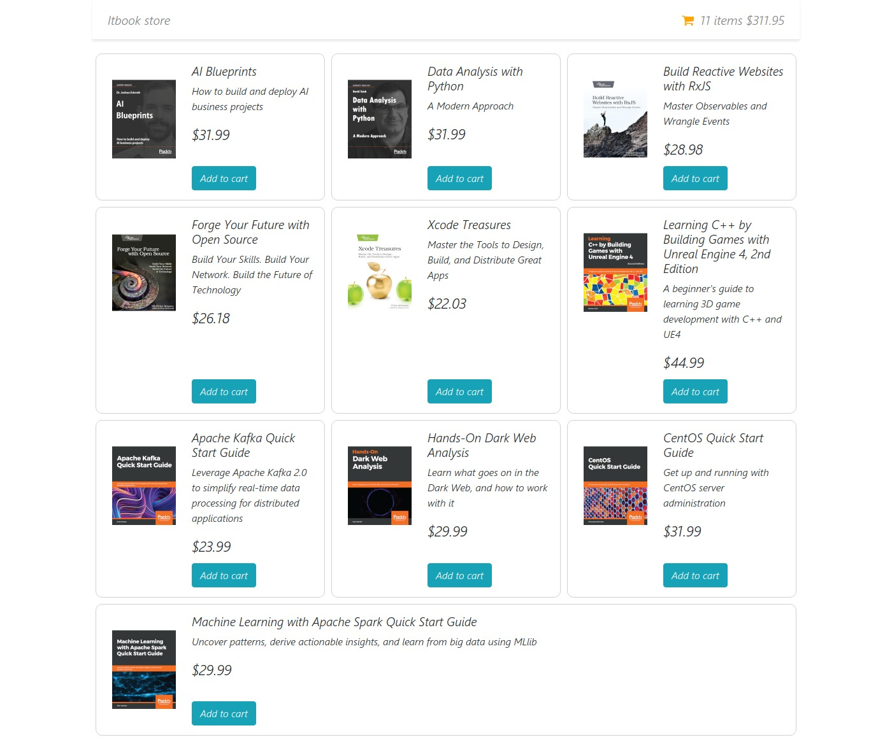
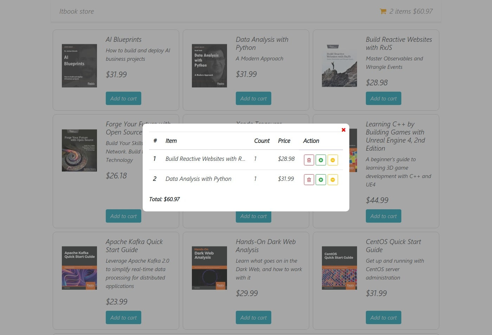
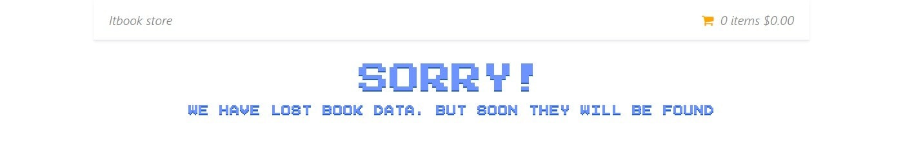

# Bookstore React-Redux 

[Look into a live project](https://bukovski.github.io/redux-book-store-simple/ "live sample launch")

I did this single-page project to work out my skills in React, but I hope you'll need it too.

### Install

To start a project, you must set up all npm dependent commands.
> npm install

And then for run project use command
> npm run start

### Built With

*  React Context for get load data to redux state 
* [redux-thunk](https://github.com/reduxjs/redux-thunk) for async requests.
* [prop-types](https://github.com/facebook/prop-types) for describe all props
* [styled-components](https://github.com/styled-components/styled-components) easy style management through props
* [bootstrap](https://bootstrap-4.ru/docs/4.4/getting-started/introduction/) for quick styling
* this animation for a loading indicator from the [codepen link](https://codepen.io/xhepigerta/pen/bprWbR)
* error animation from [codepen link](https://codepen.io/robinselmer/pen/MwOQxQ)

